# Techlution AI — Backend Architecture Documentation

> Complete database, API, and business logic reference for the Admin Portal.

---

## Table of Contents

1. [ER Diagram (Mermaid)](#er-diagram)
2. [Complete API Mapping](#api-mapping)
3. [Business Logic Notes](#business-logic)

---

## ER Diagram

```mermaid
erDiagram

    %% ═══════════════════════════════════════════════════════════════
    %% CORE ENTITIES
    %% ═══════════════════════════════════════════════════════════════

    ADMIN_USER {
        text id PK
        varchar username UK
        varchar email UK
        text password_hash
        varchar name
        enum role "SUPER_ADMIN|ADMIN|HR|FINANCE|MANAGER|SUPPORT"
        boolean is_active
        timestamptz last_login_at
        timestamptz created_at
        timestamptz updated_at
    }

    USER {
        text id PK
        varchar email UK
        text password
        varchar name
        enum role "ADMIN|CLIENT|STAFF"
        boolean is_active
        text refresh_token
        timestamptz last_login_at
        timestamptz created_at
        timestamptz updated_at
    }

    VISITOR {
        text id PK
        varchar ip_address
        enum device "DESKTOP|MOBILE|TABLET|OTHER"
        varchar browser
        varchar os
        varchar page
        varchar referrer
        varchar country
        varchar city
        varchar session_id
        timestamptz created_at
    }

    LEAD {
        text id PK
        varchar name
        varchar email
        varchar phone
        varchar company
        varchar service
        text message
        enum type "INQUIRY|PROPOSAL"
        varchar budget
        varchar timeline
        enum status "NEW|CONTACTED|QUALIFIED|CLOSED"
        varchar ip_address
        text user_agent
        timestamptz created_at
        timestamptz updated_at
    }

    CLIENT {
        text id PK
        varchar name
        varchar email UK
        varchar phone
        varchar company
        varchar industry
        enum status "ACTIVE|INACTIVE|PROSPECT"
        text notes
        int projects
        numeric revenue
        timestamptz created_at
        timestamptz updated_at
    }

    EMPLOYEE {
        text id PK
        varchar name
        varchar email UK
        varchar phone
        varchar role
        varchar department
        enum status "ACTIVE|ON_LEAVE|TERMINATED"
        int workload
        numeric salary
        boolean is_founder
        timestamptz join_date
        text notes
        timestamptz created_at
        timestamptz updated_at
    }

    PROJECT {
        text id PK
        varchar title
        varchar slug UK
        varchar short_description
        text full_description
        enum category "HEALTHCARE|AI_ML|AUTOMATION|..."
        text[] features
        jsonb[] workflow_steps
        text[] benefits
        text[] images
        enum status "DRAFT|ACTIVE|COMPLETED|ARCHIVED"
        text[] tags
        text[] tech_stack
        int duration_weeks
        text created_by_id FK
        timestamptz created_at
        timestamptz updated_at
    }

    %% ═══════════════════════════════════════════════════════════════
    %% ASSIGNMENT & FINANCE
    %% ═══════════════════════════════════════════════════════════════

    PROJECT_ASSIGNMENT {
        text id PK
        text project_ref
        text employee_id FK
        varchar role_in_project
        timestamptz assigned_at
    }

    PROJECT_FINANCE {
        text id PK
        text project_ref UK
        numeric total_amount
        numeric fiverr_fee_percent
        boolean zakat_enabled
        numeric zakat_percent
        jsonb other_costs
        numeric total_deductions
        numeric net_amount
        numeric share_per_person
        int total_members
        boolean founder_included
        timestamptz calculated_at
        timestamptz created_at
        timestamptz updated_at
    }

    PROJECT_SHARE {
        text id PK
        text project_finance_id FK
        text employee_id FK
        numeric share_amount
        enum payment_status "PENDING|PAID"
        boolean notified
        timestamptz created_at
        timestamptz updated_at
    }

    FINANCE {
        text id PK
        enum type "INCOME|EXPENSE"
        numeric amount
        varchar description
        varchar category
        text project_ref
        timestamptz date
        timestamptz created_at
        timestamptz updated_at
    }

    %% ═══════════════════════════════════════════════════════════════
    %% LOGS & ANALYTICS
    %% ═══════════════════════════════════════════════════════════════

    ACTIVITY_LOG {
        text id PK
        varchar action
        varchar entity
        text entity_id
        text details
        varchar ip_address
        text user_agent
        text admin_user_id FK
        timestamptz created_at
    }

    EMAIL_LOG {
        text id PK
        varchar to
        varchar subject
        varchar type
        text project_ref
        enum status "SENT|FAILED"
        text error
        timestamptz created_at
    }

    ANALYTICS_SNAPSHOT {
        text id PK
        timestamptz date
        varchar metric
        numeric value
        jsonb metadata
        timestamptz created_at
    }

    AI_RECOMMENDATION {
        text id PK
        varchar priority "high|medium|low"
        varchar type
        varchar message
        varchar action
        varchar route
        boolean is_resolved
        timestamptz resolved_at
        timestamptz created_at
        timestamptz updated_at
    }

    %% ═══════════════════════════════════════════════════════════════
    %% RELATIONSHIPS
    %% ═══════════════════════════════════════════════════════════════

    USER             ||--o{ PROJECT            : "creates"
    EMPLOYEE         ||--o{ PROJECT_ASSIGNMENT : "assigned_to"
    PROJECT_FINANCE  ||--o{ PROJECT_SHARE      : "distributes"
    EMPLOYEE         ||--o{ PROJECT_SHARE      : "receives"
    ADMIN_USER       ||--o{ ACTIVITY_LOG       : "generates"
```



---

## API Mapping

### Authentication

| Method | Endpoint                          | Auth     | Permission              | Description                    |
|--------|-----------------------------------|----------|-------------------------|--------------------------------|
| POST   | `/api/admin/login`                | Public   | —                       | Admin login (returns JWT)      |
| GET    | `/api/admin/dashboard`            | Admin    | —                       | Dashboard summary stats        |
| GET    | `/api/admin/dashboard/trends`     | Admin    | —                       | Dashboard trend data           |
| POST   | `/api/auth/register`              | Public   | —                       | Client/staff registration      |
| POST   | `/api/auth/login`                 | Public   | —                       | Client/staff login             |
| POST   | `/api/auth/refresh`               | Public   | —                       | Refresh JWT token              |
| POST   | `/api/auth/logout`                | Bearer   | —                       | Invalidate token               |
| GET    | `/api/auth/me`                    | Bearer   | —                       | Current user profile           |

### Admin Users

| Method | Endpoint                          | Auth     | Permission              | Description                    |
|--------|-----------------------------------|----------|-------------------------|--------------------------------|
| GET    | `/api/admin/users`                | Admin    | SUPER_ADMIN / ADMIN     | List admin users               |
| POST   | `/api/admin/users`                | Admin    | SUPER_ADMIN             | Create admin user              |
| PUT    | `/api/admin/users/:id`            | Admin    | SUPER_ADMIN             | Update admin user              |
| DELETE | `/api/admin/users/:id`            | Admin    | SUPER_ADMIN             | Delete admin user              |

### Activity Logs

| Method | Endpoint                          | Auth     | Permission              | Description                    |
|--------|-----------------------------------|----------|-------------------------|--------------------------------|
| GET    | `/api/admin/logs`                 | Admin    | logs                    | List activity logs (paginated) |

### Visitors

| Method | Endpoint                          | Auth     | Permission              | Description                    |
|--------|-----------------------------------|----------|-------------------------|--------------------------------|
| GET    | `/api/admin/visitors`             | Admin    | visitors:read           | List visitors (paginated)      |
| GET    | `/api/admin/visitors/stats`       | Admin    | visitors:read           | Visitor statistics             |
| POST   | `/api/admin/visitors`             | Admin    | visitors:write          | Track new visitor              |

### Leads

| Method | Endpoint                          | Auth     | Permission              | Description                    |
|--------|-----------------------------------|----------|-------------------------|--------------------------------|
| GET    | `/api/admin/leads`                | Admin    | leads:read              | List leads (paginated)         |
| GET    | `/api/admin/leads/stats`          | Admin    | leads:read              | Lead statistics                |
| GET    | `/api/admin/leads/:id`            | Admin    | leads:read              | Get single lead                |
| POST   | `/api/admin/leads`                | Admin    | leads:write             | Create lead manually           |
| PUT    | `/api/admin/leads/:id`            | Admin    | leads:write             | Update lead status/data        |
| DELETE | `/api/admin/leads/:id`            | Admin    | leads:write             | Delete lead                    |

### Clients

| Method | Endpoint                          | Auth     | Permission              | Description                    |
|--------|-----------------------------------|----------|-------------------------|--------------------------------|
| GET    | `/api/admin/clients`              | Admin    | clients:read            | List clients (paginated)       |
| GET    | `/api/admin/clients/stats`        | Admin    | clients:read            | Client statistics              |
| GET    | `/api/admin/clients/:id`          | Admin    | clients:read            | Get single client              |
| POST   | `/api/admin/clients`              | Admin    | clients:write           | Create client                  |
| PUT    | `/api/admin/clients/:id`          | Admin    | clients:write           | Update client                  |
| DELETE | `/api/admin/clients/:id`          | Admin    | clients:write           | Delete client                  |

### Team (Employees)

| Method | Endpoint                          | Auth     | Permission              | Description                    |
|--------|-----------------------------------|----------|-------------------------|--------------------------------|
| GET    | `/api/admin/employees`            | Admin    | employees:read          | List employees (paginated)     |
| GET    | `/api/admin/employees/stats`      | Admin    | employees:read          | Employee statistics            |
| GET    | `/api/admin/employees/:id`        | Admin    | employees:read          | Get single employee            |
| POST   | `/api/admin/employees`            | Admin    | employees:write         | Create employee                |
| PUT    | `/api/admin/employees/:id`        | Admin    | employees:write         | Update employee                |
| DELETE | `/api/admin/employees/:id`        | Admin    | employees:write         | Delete employee                |

### Finance (Income / Expense Ledger)

| Method | Endpoint                          | Auth     | Permission              | Description                    |
|--------|-----------------------------------|----------|-------------------------|--------------------------------|
| GET    | `/api/admin/finance`              | Admin    | finance:read            | List transactions (paginated)  |
| GET    | `/api/admin/finance/summary`      | Admin    | finance:read            | Revenue, expenses, profit      |
| GET    | `/api/admin/finance/:id`          | Admin    | finance:read            | Get single transaction         |
| POST   | `/api/admin/finance`              | Admin    | finance:write           | Record income/expense          |
| PUT    | `/api/admin/finance/:id`          | Admin    | finance:write           | Update transaction             |
| DELETE | `/api/admin/finance/:id`          | Admin    | finance:write           | Delete transaction             |

### Project Finance (Cost Sharing)

| Method | Endpoint                                       | Auth  | Permission      | Description                          |
|--------|------------------------------------------------|-------|-----------------|--------------------------------------|
| POST   | `/api/admin/project-finance/calculate`         | Admin | finance:write   | Calculate cost sharing for project   |
| GET    | `/api/admin/project-finance/:projectRef`       | Admin | finance:read    | Get project finance details          |
| GET    | `/api/admin/project-finance/:projectRef/assignments` | Admin | finance:read | Get project team assignments       |
| POST   | `/api/admin/project-finance/notify`            | Admin | finance:write   | Send share notification emails       |
| PUT    | `/api/admin/project-finance/shares/:shareId/pay` | Admin | finance:write | Mark individual share as paid       |

### Analytics

| Method | Endpoint                                | Auth  | Permission | Description                            |
|--------|-----------------------------------------|-------|------------|----------------------------------------|
| GET    | `/api/admin/analytics/overview`         | Admin | analytics  | Full overview (visitors, leads, etc.)  |
| GET    | `/api/admin/analytics/leads`            | Admin | analytics  | Lead funnel & conversion analytics     |
| GET    | `/api/admin/analytics/visitors`         | Admin | analytics  | Visitor device, geo, time analytics    |
| GET    | `/api/admin/analytics/finance`          | Admin | analytics  | Revenue, expense, profit trends        |
| GET    | `/api/admin/analytics/projects`         | Admin | analytics  | Project status distribution            |
| GET    | `/api/admin/analytics/hr`              | Admin | analytics  | Employee workload & department stats   |
| GET    | `/api/admin/analytics/insights`         | Admin | —          | AI-generated business insights         |
| GET    | `/api/admin/analytics/recommendations`  | Admin | —          | Priority-based action recommendations  |

### Reports

| Method | Endpoint                          | Auth  | Permission | Description                          |
|--------|-----------------------------------|-------|------------|--------------------------------------|
| GET    | `/api/admin/reports/download`     | Admin | —          | Download weekly PDF report (blob)    |
| POST   | `/api/admin/reports/generate`     | Admin | —          | Generate & save report to disk       |
| POST   | `/api/admin/reports/email`        | Admin | —          | Email report to admin immediately    |
| GET    | `/api/admin/reports/email-logs`   | Admin | —          | List email delivery logs             |

### Projects (Public + Protected)

| Method | Endpoint                          | Auth     | Permission         | Description                    |
|--------|-----------------------------------|----------|--------------------|--------------------------------|
| GET    | `/api/projects`                   | Public   | —                  | List all published projects    |
| GET    | `/api/projects/:id`               | Public   | —                  | Get project by ID or slug      |
| POST   | `/api/projects`                   | Bearer   | —                  | Create project                 |
| PATCH  | `/api/projects/:id`               | Bearer   | —                  | Update project                 |
| DELETE | `/api/projects/:id`               | Bearer   | ADMIN / STAFF      | Delete project                 |
| POST   | `/api/projects/generate`          | Bearer   | —                  | AI-generate project content    |

### Contact (Public Forms)

| Method | Endpoint                          | Auth     | Permission         | Description                    |
|--------|-----------------------------------|----------|--------------------|--------------------------------|
| POST   | `/api/contact`                    | Public   | —                  | Submit contact inquiry         |
| POST   | `/api/contact/project`            | Public   | —                  | Submit project request         |
| GET    | `/api/contact`                    | Bearer   | ADMIN / STAFF      | List contact leads             |
| PATCH  | `/api/contact/:id`                | Bearer   | ADMIN / STAFF      | Update contact lead status     |

### Healthcare Module

| Method | Endpoint                              | Auth   | Permission     | Description                |
|--------|---------------------------------------|--------|----------------|----------------------------|
| POST   | `/api/healthcare/patients`            | Bearer | ADMIN / STAFF  | Create patient             |
| GET    | `/api/healthcare/patients`            | Bearer | ADMIN / STAFF  | List patients              |
| GET    | `/api/healthcare/patients/:id`        | Bearer | ADMIN / STAFF  | Get patient                |
| PATCH  | `/api/healthcare/patients/:id`        | Bearer | ADMIN / STAFF  | Update patient             |
| POST   | `/api/healthcare/appointments`        | Bearer | ADMIN / STAFF  | Create appointment         |
| GET    | `/api/healthcare/appointments`        | Bearer | ADMIN / STAFF  | List appointments          |
| PATCH  | `/api/healthcare/appointments/:id`    | Bearer | ADMIN / STAFF  | Update appointment         |
| POST   | `/api/healthcare/billing`             | Bearer | ADMIN / STAFF  | Create billing record      |
| GET    | `/api/healthcare/billing`             | Bearer | ADMIN / STAFF  | List billings              |
| GET    | `/api/healthcare/billing/:id`        | Bearer | ADMIN / STAFF  | Get billing detail         |
| PATCH  | `/api/healthcare/billing/:id`        | Bearer | ADMIN / STAFF  | Update billing             |
| POST   | `/api/healthcare/denials`             | Bearer | ADMIN / STAFF  | Create denial              |
| GET    | `/api/healthcare/denials`             | Bearer | ADMIN / STAFF  | List denials               |

### Workflows

| Method | Endpoint                              | Auth   | Permission     | Description                |
|--------|---------------------------------------|--------|----------------|----------------------------|
| POST   | `/api/workflows`                      | Bearer | ADMIN / STAFF  | Create workflow            |
| GET    | `/api/workflows`                      | Bearer | —              | List workflows             |
| GET    | `/api/workflows/:id`                  | Bearer | —              | Get workflow               |
| PATCH  | `/api/workflows/:id`                  | Bearer | ADMIN / STAFF  | Update workflow            |
| POST   | `/api/workflows/:id/trigger`          | Bearer | —              | Trigger workflow execution |
| POST   | `/api/workflows/webhook/:id`          | Public | —              | Webhook trigger            |

### Uploads

| Method | Endpoint                          | Auth   | Description                    |
|--------|-----------------------------------|--------|--------------------------------|
| POST   | `/api/uploads`                    | Bearer | Upload single file             |
| POST   | `/api/uploads/multiple`           | Bearer | Upload up to 10 files          |
| GET    | `/api/uploads`                    | Bearer | List uploaded files            |

---

## Business Logic

### 1. Project Cost Sharing Calculation

```
INPUT:
  totalAmount       — Gross project revenue (e.g. Fiverr order total)
  fiverrFeePercent  — Platform commission % (default: 20%)
  zakatEnabled      — Islamic charity deduction toggle
  zakatPercent      — Zakat rate (default: 2.5%)
  otherCosts[]      — Custom deductions [{name, amount}]
  teamMemberIds[]   — Selected team members
  founderIncluded   — Auto-include founder (default: true)

CALCULATION:
  fiverrFee        = totalAmount × (fiverrFeePercent / 100)
  zakatAmount      = zakatEnabled ? totalAmount × (zakatPercent / 100) : 0
  otherCostTotal   = SUM(otherCosts[].amount)
  totalDeductions  = fiverrFee + zakatAmount + otherCostTotal
  netAmount        = totalAmount - totalDeductions

  IF founderIncluded AND founder NOT in teamMemberIds:
      teamMemberIds.push(founder.id)

  totalMembers    = teamMemberIds.length
  sharePerPerson  = ROUND(netAmount / totalMembers, 2)

OUTPUT:
  ProjectFinance record (upserted)
  ProjectAssignment records per member (upserted, stale removed)
  ProjectShare records per member (upserted, stale removed)
  Socket.IO event: finance:update
  ActivityLog entry
```

### 2. Founder Auto-Inclusion Rule

- The Employee with `isFounder = true` is **always** included in project shares when `founderIncluded` is enabled (default behavior)
- Founder cannot be removed from the share list unless `founderIncluded` is explicitly set to `false`
- Founder's share is **equal** to all other team members (no preferential split)

### 3. Cost Deductions Priority

```
1. Fiverr Platform Fee (percentage of totalAmount)
2. Zakat / Charity (percentage of totalAmount, toggle-controlled)
3. Other Costs (fixed amounts — tax, tools, hosting, etc.)
─────────────────────────────────────────────────────
= totalDeductions (subtracted from totalAmount to get netAmount)
```

### 4. Deadline Reminder (12-Hour Rule)

- **Cron runs hourly** (`0 * * * *`)
- Scans all ACTIVE/DRAFT projects
- If a project's estimated deadline (createdAt + durationWeeks) falls within the next 12 hours:
  - Email all assigned team members via Nodemailer
  - Log to EmailLog table
  - Emit Socket.IO event: `project:deadline`

### 5. Email Triggers

| Event                          | Email Sent To          | Template Type         |
|--------------------------------|------------------------|-----------------------|
| Share calculated/assigned      | Each assigned member   | `share_assignment`    |
| Share amount updated           | Each assigned member   | `share_update`        |
| Project completed              | Each assigned member   | `share_completion`    |
| Weekly report (Monday 8 AM)   | Admin email            | `weekly_report` (PDF) |
| Deadline reminder (12h before) | Assigned team members  | `deadline_reminder`   |

All emails are:
- Logged in `email_logs` table with status (SENT/FAILED)
- Sent via Nodemailer (SMTP configured in `.env`)
- Premium HTML templates with Techlution AI branding

### 6. Real-Time Socket.IO Events

| Event Name         | Payload                           | Triggered By                       |
|--------------------|-----------------------------------|------------------------------------|
| `visitor:new`      | `{ id, device, page, country }`   | New visitor tracked                |
| `lead:new`         | `{ id, name, email, service }`    | New lead submitted                 |
| `client:new`       | `{ id, name, email, status }`     | New client created                 |
| `project:update`   | `{ id, title, status }`           | Project status changed             |
| `employee:new`     | `{ id, name, department }`        | New employee created               |
| `finance:update`   | `{ projectRef, netAmount, ... }`  | Cost sharing calculated            |
| `finance:new`      | `{ id, type, amount }`            | Income/expense recorded            |
| `project:deadline` | `{ projectRef, deadline }`        | Deadline within 12 hours           |

### 7. Automated Cron Jobs

| Schedule                | Job                          | Description                                    |
|-------------------------|------------------------------|------------------------------------------------|
| `0 * * * *` (hourly)   | Deadline Check               | Scan projects for approaching deadlines        |
| `0 8 * * 1` (Mon 8AM)  | Weekly Report                | Generate PDF + email to admin                  |
| `0 0 * * *` (midnight) | Analytics Snapshot           | Save 6 KPI metrics to analytics_snapshots      |

### 8. RBAC Permission Matrix

| Role         | Dashboard | Visitors | Leads | Clients | Employees | Finance | Analytics | Reports | Admin Users |
|-------------|-----------|----------|-------|---------|-----------|---------|-----------|---------|-------------|
| SUPER_ADMIN | ✅        | ✅       | ✅    | ✅      | ✅        | ✅      | ✅        | ✅      | ✅ (CRUD)   |
| ADMIN       | ✅        | ✅       | ✅    | ✅      | ✅        | ✅      | ✅        | ✅      | ✅ (Read)   |
| HR          | ✅        | ❌       | ❌    | ❌      | ✅        | ❌      | ❌        | ❌      | ❌          |
| FINANCE     | ✅        | ❌       | ❌    | ❌      | ❌        | ✅      | ✅        | ✅      | ❌          |
| MANAGER     | ✅        | ✅       | ✅    | ✅      | ✅        | ✅      | ✅        | ✅      | ❌          |
| SUPPORT     | ✅        | ✅       | ✅    | ❌      | ❌        | ❌      | ❌        | ❌      | ❌          |

---

## File Structure Reference

```
backend/
├── prisma/
│   └── schema.prisma              # Prisma ORM schema (PostgreSQL)
├── src/
│   ├── models/
│   │   └── mongoose/              # MongoDB Mongoose models (15 models)
│   │       ├── index.ts           # Barrel export
│   │       ├── AdminUser.model.ts
│   │       ├── Visitor.model.ts
│   │       ├── Lead.model.ts
│   │       ├── Client.model.ts
│   │       ├── TeamMember.model.ts
│   │       ├── Project.model.ts
│   │       ├── ProjectAssignment.model.ts
│   │       ├── ProjectFinance.model.ts
│   │       ├── ProjectShare.model.ts
│   │       ├── Finance.model.ts
│   │       ├── ActivityLog.model.ts
│   │       ├── EmailLog.model.ts
│   │       ├── Analytics.model.ts
│   │       └── AIRecommendation.model.ts
│   ├── database/
│   │   └── schema.sql             # PostgreSQL DDL (15 tables + triggers)
│   ├── controllers/               # Route handlers
│   ├── services/                  # Business logic
│   ├── routes/                    # Express route definitions
│   ├── config/                    # DB, Redis, Socket, Scheduler
│   ├── middlewares/               # Auth, RBAC, validation, upload
│   └── server.ts                  # Application entry point
```
